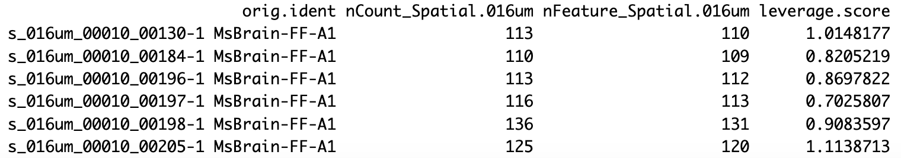
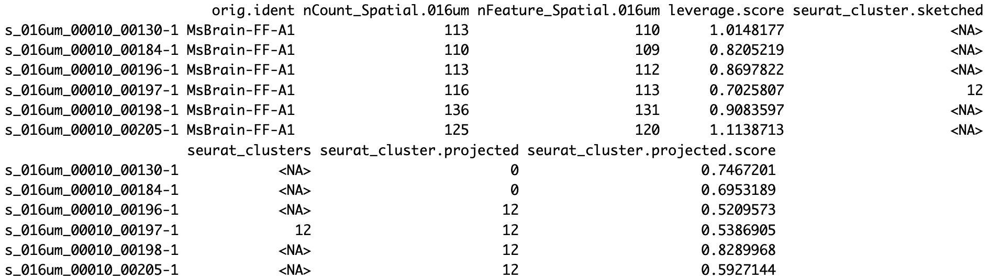
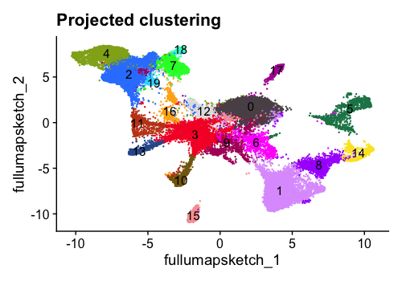

Contributors: Alex Bartlett, Meeta Mistry and Will Gammerdinger

Approximate time: 2 hours and 45 minutes

## Learning Objectives 

**TODO: Revisit these when the materials are more complete**

In this lesson, we will:
- Describe the elements of the Seurat object that are unique to spatial technologies
- Visually inspect and compare spatial scRNA-seq data before and after filtering
- Interact with the spatial Seurat object to superimpose clusters onto the image

# NGS-based Spatial Transcriptomics Data Analysis

## Mouse Brain Visium HD 

The Visium HD platform is compatible with human and mouse fresh frozen, fixed frozen, and formalin-fixed parrafin-embedded (FFPE) tissue sections. For this lesson, we will be working with data from a fresh frozen coronal section of a mouse brain sample.

Each Visium HD slide has the same 6.5 x 6.5mm capture area as previous Visium products but is covered with about 11 million tiles. These 2µm x 2µm squares are arrayed in a continuous lawn across the entire capture area. The squares are each uniquely barcoded with an oligonucleotide and contain probes allowing for the detection of the full coding transcriptome. 


## Preprocessing Data with Spaceranger

Sequencing facilities often output scRNAseq data, including spatial scRNAseq data, in FASTQ format. Because this is Visium HD data from 10X Genomics, we used their proprietary preprocessing software [Space Ranger](https://www.10xgenomics.com/support/software/space-ranger/latest) to process the FASTQ files into a count matrix and other images. Specifically, the ```spaceranger count``` command aligns the reads in the FASTQ files against a transcriptomic reference and provides their spatial location using the oligonucleotide barcode. 

<details>
<summary><b>Click here to see an example of the <code>spaceranger count</code> command</b></summary>
<br>
A sample command for running <code>spaceranger count</code> is:<br><br>
<pre>
spaceranger count --id=hd_count \
   --transcriptome=/path/to/refdata-gex-GRCh38-2020-A \
   --fastqs=/path/to/fastq \
   --probe-set=/path/to/Visium_Human_Transcriptome_Probe_Set_v2.0_GRCh38-2020-A.csv \
   --slide=H1-YD7CDZK \
   --area=A1 \
   --cytaimage=/path/to/CAVG10539_2023-11-16_14-56-24_APPS115_H1-YD7CDZK_A1_S11088.tif \
   --image=/path/to/APPS115_11088_rescan_01.btf \
   --create-bam=false
</pre>
<hr />
</details>

Note that Space Ranger requires a Linux system with at least 32 cores, 64GB of RAM, and 1TB of disk space. 

When ```spaceranger count``` completes successfully, it will generate output similar to the following, which will enable the analyst to perform further analysis in R or Python or using the proprietary Loupe browser from 10X Genomics. 

<p align="center">

</p>

In the Visium HD assay, in addition to providing data at the level of the 2µm x 2µm squares, Space Ranger also bins the 2µm x 2µm squares into 8µm x 8µm and 16µm x 16µm bins. Most of the above output is produced for each binning resolution. 

While the single-digit micron resolution is a big technological improvement over original Visium’s original ∼55μm spots, the higher resolution also presents challenges. Having access to 2μm bins along with matching morphology information provides a great opportunity for reconstructing single cells from the data, which is undoubtedly very powerful. However, because the 2µm  x 2µm squares (and even the 8µm x 8µm bins) are so small, there is a potential for very little biological signal to be captured per bin. Additionally, the sheer number of bins at these higher resolutions can present challenges in terms of computational time and resources. **For the purposes of this lesson, we will use the 16µm x 16µm bins.**

We can view and explore the web summary HTML of our data found in the "reports" folder of your project. 


## Analysis workflow

**TODO Insert figure of workflow here** - can create this after the lesson is complete.

### Setting up 

For this module, we will be working within an RStudio project. In order to follow along you should have **downloaded the R project**.

> If you haven't done this already, the project is located in "Dataset for workshop" -> "Day 2- NGS-based- VisiumHD" in the course DropBox.

Once downloaded, you should see a file called `visiumHD_nanocourse.zip` on your computer (likely, in your `Downloads` folder). 

1. **Unzip this file.** This will result in a folder of the same name. 
2. **Move the folder to the location on your computer where you would like to perform the analysis.**
3. **Open up the folder.** The contents will look like the screenshot below:

   <p align="center">
   
   </p>

4. **Locate the `.Rproj file` and double-click on it.** This will open up RStudio with the "visiumHD_nanocourse" project loaded. 
5. **Open a new Rscript file.**
6. **Start with some comments to indicate what this file is going to contain:**

   ```
   # February 26th, 2025
   # Spatial Transcriptomics: Session 2
   ```

7. **Save the Rscript in the `code` folder as `visiumHD.R`.** Your working directory should look something like this:

   <p align="center">
   
   </p>

## Loading Libraries

Next, we will need to be sure to load the libraries that we will be using:

```
# Load libraries
library(tidyverse)
library(patchwork)
library(Seurat)
library(qs)
library(SeuratWrappers)
library(Banksy)
library(quadprog)
library(spacexr)

# Increases the size of the default vector
options(future.globals.maxSize= 2000000000)
```

## Creating the Seurat Object

The Seurat object is a custom list-like object that has well-defined spaces to store specific information/data for single-cell experiments, including spatial experiments and Visium HD.

The Seurat package provides a function ```Load10X_Spatial()``` to easily create a Seurat object from the output of Space Ranger. The ```Load10X_Spatial``` function takes as input the feature matrix and the low-resolution tissue image from the output of Space Ranger and generates a Seurat object containing both gene-level counts and spatial information. 

**We will not have you run this code**, as this can take some time and the Space Ranger output files are quite large to share. Instead, you will load the pre-made Seurat object. 

<details>
<summary><b>Click here to see the R code used to create the Seurat object</b></summary>
<br>The code to create the Seurat object is:<br><br>
<pre>
localdir <- '../path/to/spaceranger/outs/'<br>
&#35; Load the raw feature matrix
object <- Load10X_Spatial(data.dir = localdir,
                          filename = 'raw_feature_bc_matrix.h5',
                          bin.size = 16)
</pre>
<hr />
</details>

### Explore the object

Let's read in the Seurat object and talk about some very basic slots that we will be accessing. 

```
# Load in Seurat object
object <- qread('data_processed/MsBrain_FF-A1_subset.qs')
```

We can print the Seurat object by using:

```
object
```

Now we can examine its major features, which we will add to and alter throughout the lesson:

<p align="center">

</p>


***

**Exercise**

There are 3 things about our Seurat object printout that would be different if we were using the 8µm x 8µm binning instead of the 16µm x 16µm binning. What are these three differences?

<details>
<summary><b>Click here to use an app that lets you explore different bin sizes for this Seurat object</b></summary>
<p align="center"><iframe src="https://hcbc.connect.hms.harvard.edu/Spatial_resolution_question_1/?showcase=0" width="600px" height="250px" data-external="1"> </iframe></p>
</details>

***

## Quality Control

The main objective of quality control is to filter the data so that we include only data from bins that are of high-quality. This makes it so that when we cluster our bins, it is easier to identify distinct cell type populations.

In Visium HD data, the main challenge is in **delineating bins that are poor quality from bins containing reads from less complex cells**. If you expect a particular cell type in your dataset to be less transcriptionally active as compared other cell types in your dataset, the bins underneath this cell type will naturally have fewer detected genes and transcripts. However, having fewer detected genes and transcripts can also be a technical artifact and not a result of biological signal. 

Various metrics can be used to filter low-quality cells from high-quality ones, including:

- **UMI counts per bin** - This is the number of unique transcripts detected per bin. Because the bins are very small, this number is less than what we would expect for non-spatial scRNA-seq data.
- **Genes detected per bin** - This is the number of unique genes detected per bin. Again, because the bins are very small, this number is less than what we would expect for non-spatial scRNA-seq data.
- **Complexity (novelty score)** - The novelty score is computed as shown below:

   <p align="center">
   
   </p>

   If there are many captured transcripts (high nUMI) and a low number of genes detected in a bin, this likely means that you only captured a low number of genes and simply sequenced transcripts from those lower number of genes over and over again. These low complexity (low novelty) bins could represent a specific cell type (i.e. red blood cells, which lack a typical transcriptome), or could be due to an artifact or contamination. Generally, we expect the complexity score to be above 0.80 for good-quality bins.

- **Mitochondrial counts ratio** - This metric can identify whether there is a large amount of mitochondrial contamination from dead or dying cells. We define poor-quality samples for mitochondrial counts as bins which surpass the 0.2 mitochondrial ratio threshold, unless of course you are expecting this in your sample. This ratio is computed as:

   <p align="center">
   
   </p>

Let's take a quick look at the data and make a decision on whether we need to apply any filtering. We will examine the distributions of UMI counts per bin and genes detected per bin to determine reasonable thresholds for those metrics to implement during QC filtering.

### Pre-filtering 
To create some plots first, we will need to create a metadata object using this command:

```
object_meta <- object@meta.data
```

Now we can plot the number of UMIs (nUMI) and the number of genes (nGene) side-by-side.
**Add some text here - what do we see? What do we expect?**

```
# Create a plot for nUMI
dist_counts_before <- object_meta %>%
  ggplot(aes(x=nCount_Spatial.016um)) +
  geom_density(alpha = 0.2) +
  scale_x_log10() +
  theme_classic() +
  ylab("Cell density") +
  xlab("Number of UMIs per bin") +
  ggtitle('Pre-QC UMIs/Bin') +
  theme(plot.title = element_text(hjust = 0.5))

# Create a plot for nGene
dist_features_before <- object_meta %>%
  ggplot(aes(x=nFeature_Spatial.016um)) +
  geom_density(alpha = 0.2) +
  scale_x_log10() +
  theme_classic() +
  ylab("Cell density") +
  xlab("Number of genes per bin") +
  ggtitle('Pre-QC Genes/Bin') +
  theme(plot.title = element_text(hjust = 0.5))

dists_before <- dist_counts_before | dist_features_before
dists_before
```

<p align="center">

</p>

***

**Exercise**

Using the distribution plots in the app below, what do you think would be good minimum thresholds for nGene and nUMI? 

<p align="center"><iframe src="https://hcbc.connect.hms.harvard.edu/Spatial_threshold_question_2/?showcase=0" width="800px" height="410px" data-external="1"> </iframe></p>


***

### Post-Filtering

We will apply very minimal filtering here, with nUMI > 100 and nGene > 100. It has been shown that low expression can be biologically meaningful for spatial context so we won't be as stringent as we normally are with scRNA-seq.


```
# Create a filtered object
object_filt <- subset(object, (nCount_Spatial.016um > 100) & 
                        (nFeature_Spatial.016um > 100))
```

Now, we can create similar plots with filtered data. As expected, we see that the small left peak in the distribution has vanished, leaving the higher quality bins, which are the majority of the data. 

```
# Create a new metadata data frame 
object_filt_meta <- object_filt@meta.data

# Plot nUMI
dist_counts_after <- object_filt_meta %>%
  ggplot(aes(x=nCount_Spatial.016um)) +
  geom_density(alpha = 0.2) +
  scale_x_log10() +
  theme_classic() +
  ylab("Cell density") +
  xlab("Number of UMIs per bin") +
  ggtitle('PostQC UMIs/Bin') +
  theme(plot.title = element_text(hjust = 0.5))

# Plot nGene
dist_features_after <- object_filt_meta %>%
  ggplot(aes(x=nFeature_Spatial.016um)) +
  geom_density(alpha = 0.2) +
  scale_x_log10() +
  theme_classic() +
  ylab("Cell density") +
  xlab("Number of genes per bin") +
  ggtitle('PostQC Genes/Bin') +
  theme(plot.title = element_text(hjust = 0.5))

# Combine plots side-by-side
dists_after <- dist_counts_after | dist_features_after
dists_after
```

<p align="center">

</p> 


### Visualizing Counts Data

We can visualize the number of UMIs and gene counts per bin, both as a distribution and layered on top of the tissue image. Let's start with a violin plot to look at the distribution of UMI counts and gene counts. The input is our post-filtered dataset.

```

# Violin plot of UMI counts
vln_counts_after <- VlnPlot(object_filt, 
                            features = "nCount_Spatial.016um", 
                            pt.size = 0, 
                            group.by = 'orig.ident') + 
  NoLegend() + scale_y_log10() + ggtitle('nUMI') + xlab('') + ylim(c(100, 15000))

# Violin plot of gene counts
vln_features_after <- VlnPlot(object_filt, 
                            features = "nFeature_Spatial.016um", 
                            pt.size = 0, 
                            group.by = 'orig.ident') + 
  NoLegend() + scale_y_log10() + ggtitle('nGene') +  xlab('') + ylim(c(100, 15000))


# Plot both side by side
vln_counts_after | vln_features_after
```

We see that both distributions have a similar peak but the nUMI distribution has a much longer tail. This is expected, because while the small physical size of the bins means that most genes will be detected only once or twice, a minority of bins under very transcriptionally active cells may exhibit multiple transcripts of the same gene. 

<p align="center">

</p> 

Next, we can look at the same metrics and the distribution on the actual image itself. Note that many spots have very few counts, in part due to low cellular density or cell types with low complexity in certain tissue regions.

```
# Visualizing UMI count across the image
image_counts <- SpatialFeaturePlot(object_filt, 
                                   feature = 'nCount_Spatial.016um', 
                                   pt.size.factor = 8)

# Visualizing gene count across the image
image_features <- SpatialFeaturePlot(object_filt, 
                                     features = "nFeature_Spatial.016um", 
                                     pt.size.factor = 8) 

# Plot the two side-by-side
image_counts | image_features

```

<p align="center">

</p> 


## Normalize Data

Normalization is important in order to make expression counts comparable across genes and/or samples. We note that the best normalization methods for spatial data are still being developed and evaluated. In particular, [Bhuva et. al](https://genomebiology.biomedcentral.com/articles/10.1186/s13059-024-03241-7) tested a variety of normalization techniques and found that normalizing by the number of transcripts detected per bin negatively affects spatial domain identification because total detections per bin can represent real biology. We are cognizant of this, but as discussed earlier, it can be challenging to determine whether a bin has few detections because of a technical artifact or biological signal. In the absence of normalization, this lack of signal will strongly affect clustering regardless of whether it is technical or biological. For this reason, we apply a standard log-transformed library size normalization to our data. 

```
object_filt <- NormalizeData(object_filt, assay = 'Spatial.016um')
```

After normalization, we can call our Seurat object with:

```
object_filt
```

And we can see that there is now a new "data" layer in the Seurat object. 

<p align="center">

</p>


## Unsupervised Clustering

The authors of the Seurat package recommend the Seurat v5 sketch clustering workflow because it exhibits improved performance for large datasets, especially for identifying rare and spatially-restricted groups. Sketch-based analyses aim to "subsample" large datasets in a way that preserves rare populations. 

**Is there a visualization for this workflow that we can include here?** No, not from Seurat
**TODO: make visualization?**

We will start by defining a set of highly variable genes. _Note that this is being done on all bins in our object._ Using this list of genes will help us to quantify the variability and similarity between bins. 

```
object_filt <- FindVariableFeatures(object_filt)
```
We can examine our Seurat object and see that ```FindVariableFeatures()``` has added 2,000 variable features.

```
object_filt
```

<p align="center">

</p>

Next, we select 10,000 cells and create a new sub-sampled "sketch" assay using the `SketchData()` function. The function takes a normalized single-cell dataset containing a set of variable features and returns a Seurat object with a new assay (sketch), consisting of 10,000 bins selected based off a "leverage score" for each bin. The leverage score reflects the magnitude of its contribution to the gene-covariance matrix, and its importance to the overall dataset, with rare populations earning a higher leverage score. This means that our 10,000 cells selected for the sketch will oversample rare populations, retaining the biological complexity of the sample, while drastically compressing the dataset.

```
# we select 10,000 cells and create a new 'sketch' assay
object_filt <- SketchData(
  object = object_filt,
  assay = 'Spatial.016um',
  ncells = 10000,
  method = "LeverageScore",
  sketched.assay = "sketch"
)
```
Now that we have the sketched data, we can call the Seurat object:

```
object_flit
```

We will see that there are four major changes that have taken place:

- The number of features in the second line has double, because we have added a new assay
- Accordingly, the number of assays has increased from one to two
- The active assay has change from `Spatial.016um` to `sketch`
- There is a new line listing additional assays that exist in the Seurat object

<p align="center">

</p>

We can also see that the leverage score has been added as a column to the metadata of our object.

```
head(object_filt@meta.data)
```

Should return:

<p align="center">

</p>


Next, we will peform a standard clustering workflow on our sketch of 10,000 cells:

* `FindVariableFeatures`: As before, this generates a list of highly variable genes, which may be slighly different for the sketched dataset than for the full dataset
* `ScaleData`: Highly variable genes will be confounded with the most highly expressed genes, so we need to adjust for this
* `RunPCA`: Perform a principal component analysis using our scaled data and variable genes. This will emphasize variation in gene expression as well as similarity across bins
* `FindNeighbors`: Determine the Euclidean distance between bins in PCA space
* `FindClusters`: Iteratively group bins together based on neighborhood distances. Higher resolution will yield more groups. 


```
object_filt <- FindVariableFeatures(object_filt)
object_filt <- ScaleData(object_filt)
object_filt <- RunPCA(object_filt, assay = "sketch", reduction.name = "pca.sketch")
object_filt <- FindNeighbors(object_filt, assay = "sketch", reduction = "pca.sketch", dims = 1:50)
object_filt <- FindClusters(object_filt, cluster.name = "seurat_cluster.sketched", resolution = .65)
```

Finally, let's use UMAP using the principal components as input. UMAP is a method that aims to place cells with similar local neighborhoods in high-dimensional space together in low-dimensional space, which is useful for visualizing our newly calculated clusters. We observe good separation between groups annotated as separate clusters, which is sign that our clustering indeed represents various cell types. 

```
object_filt <- RunUMAP(object_filt, reduction = "pca.sketch", reduction.name = "umap.sketch", return.model = T, dims = 1:50)

# Plot UMAP
DimPlot(object_filt, reduction = "umap.sketch", label = T,  cols = 'polychrome') + 
  ggtitle("Sketched clustering") + 
  theme(legend.position = "none")
```

<p align="center">

</p> 


We can also examine our object after these manipulations and note the addition of the scale.data layer as well as the sketch PCA and UMAP dimensional reductions. 

```
object_filt
```

Should return:

<p align="center">

</p>


## Project cluster labels back to the full dataset

Now that we have our clusters and dimensional reductions from our sketched dataset, we need to extend these to the full dataset.  The `ProjectData` function projects all the bins in the dataset (the `Spatial.016um` assay) onto the `sketch` assay. 

```
object_filt <- ProjectData(
  object = object_filt,
  assay = "Spatial.016um",
  full.reduction = "full.pca.sketch",
  sketched.assay = "sketch",
  sketched.reduction = "pca.sketch",
  umap.model = "umap.sketch",
  dims = 1:50,
  refdata = list(seurat_cluster.projected = "seurat_cluster.sketched")
)
```

Using the sketch PCA and UMAP, the `ProjectData` function returns a Seurat object that includes:
* **Dimensional reduction (PCA)** - The `full.pca.sketch` dimensional reduction extends the PCA reduction on the sketched cells to all bins in the dataset
* **Dimensional reduction (UMAP)** - The `full.umap.sketch` dimensional reduction extends the UMAP reduction on the sketched cells to all bins in the dataset
* **Cluster labels** - The `seurat_cluster.projected` column in the object metadata now labels all cells in the dataset with one of the cluster labels derived from the sketched cells

We can now see the additional full-dataset reductions in the object.

```
object_filt
```

Should return:

<p align="center">

</p>

Note that a score for the projection of each bin will be saved as a column in the metadata. Actually opening up the metadata again gives the opportunity to look at the `seurat_cluster.sketched` column and see many NA values, because it was only calculated for 10,000 bins. The `seurat_cluster.projected` shows values for every bin.

<p align="center">

</p>

### Visualizing the projected clusters on UMAP

We can now visualize our clusters from the projected assignments. The UMAP plot now contains more points, which is expected because we are now visualizing the full dataset rather than our 10,000 bin sketch. Nonetheless, we can see that the full dataset is still well-representated by the projected dimensional reduction and clustering. 

```
# switch to full dataset assay
DefaultAssay(object_filt) <- "Spatial.016um"

# Change the idents to the projected cluster assignments
Idents(object_filt) <- "seurat_cluster.projected"

# Plot the UMAP
DimPlot(object_filt, reduction = "full.umap.sketch", label = T, raster = F, 
              cols = 'polychrome') +
  ggtitle("Projected clustering") + 
  theme(legend.position = "none")
```

<p align="center">

</p>

### Visualizing projected clusters on the image

In order to see the clusters superimposed on our image we can use the `SpatialDimPlot()` function. We will also set the color palette and convert the cluster assignments to a factor so they are ordered numerically rather than lexicographically in the figure.

```
# Arrange so clusters get listed in numerical order
object_filt$seurat_cluster.projected <- object_filt$seurat_cluster.projected %>% 
  as.numeric %>% as.factor()

# Set color palette
color_pal <- Seurat::DiscretePalette(n = length(unique(object_filt$seurat_cluster.projected)),
                                    palette = "polychrome")
names(color_pal) <- sort(unique(object_filt$seurat_cluster.projected))
image_seurat_clusters <- SpatialDimPlot(object_filt, 
                                        group.by = 'seurat_cluster.projected', 
                                        pt.size.factor = 8, cols = color_pal) +
  guides(fill=guide_legend(ncol=2))

image_seurat_clusters
```

<p align="center">

</p>

## Spatially-informed Clustering

[BANKSY](https://www.nature.com/articles/s41588-024-01664-3) is another method for performing clustering. Unlike Seurat, BANKSY takes into account not only an individual bin’s expression pattern but also the mean and the gradient of gene expression levels in a bin’s broader neighborhood. This makes it valuable for identifying and defining spatial regions of interest.

We use the `RunBanksy` function to create a new "BANKSY" assay based on a default of the 4,000 most highly variable features, which can be used for dimensionality reduction and clustering. Two parameters of importance are:
* `k_geom` - Local neighborhood size. Larger values will yield larger domains
* `lambda` - Influence of the neighborhood. Larger values yield more spatially coherent domains. The authors recommend using 0.8 to identify broader spatial domains. 

```
# Run Banksy
object_filt <- RunBanksy(object_filt, lambda = 0.8, verbose = T,
                         assay = 'Spatial.016um', slot = 'data', k_geom = 50)

```

We can see the new BANKSY assay in our object

<p align="center">

</p>

We perform a simplified clustering workflow on the BANKSY assay.

```
object_filt <- RunPCA(object_filt, assay = "BANKSY", 
                      reduction.name = "pca.banksy", 
                      features = rownames(object_filt), npcs = 30)
object_filt <- FindNeighbors(object_filt, reduction = "pca.banksy", 
                             dims = 1:30)
object_filt <- FindClusters(object_filt, cluster.name = "banksy_cluster",
                            resolution = 0.5)
```

Let's visualize the BANKSY clusters alongside the Seurat clusters for a side-by-side comparison:

```

color_pal <- Seurat::DiscretePalette(n = length(unique(object_filt$banksy_cluster)),
                                    palette = "polychrome")
names(color_pal) <- sort(unique(object_filt$banksy_cluster))

image_banksy_clusters <- SpatialDimPlot(object_filt, group.by = "banksy_cluster", pt.size.factor = 7,
               cols = color_pal)

image_seurat_clusters | image_banksy_clusters

```

<p align="center">

</p>


We can see that, as expected, the BANKSY clusters are more spatially-restricted, or more compact, than the Seurat clusters. We also see that the BANKSY clusters are less noisy than the Seurat clusters, likely because of the smoothing effect of considering a cell's spatial neighborhood when assigning a cluster label. 

<details>
<summary><b>Click here to see BANKSY using a lambda value of 0.2</b></summary>
<br>If we had run BANKSY with <code>lambda = 0.2</code>, as recommended for cell type clustering instead of <code>lambda = 0.8</code> for spatial domain clustering, the resultant clusters would be less spatially restricted (in other words more compact and less distributed throughout the image) and more similar to our Seurat clustering. Below is a figure using <code>lamba=0.2</code> in BANKSY rather than <code>lamba=0.8</code>:<br><br>
<p align="center">

</p>
<hr />
</details>


## Cell Type Annotation
Perhaps we are particularly interested in understanding the organization of cell types in the cortical region of the brain. We first subset our Seurat object to this region of interest. There are multiple ways of subsetting a Seurat object to a region of interest, but here we have identified a handful of cluster numbers that appear almost exclusively in the cortical region, and we will subset the object to only include cells that are assigned these cluster numbers. 

```{r}
cortex <- subset(object_filt, seurat_cluster.projected %in% c(18, 19, 7, 2, 4))

color_pal <- Seurat::DiscretePalette(n = length(unique(object_filt$seurat_cluster.projected)),
                                    palette = "polychrome")
names(color_pal) <- sort(unique(object_filt$seurat_cluster.projected))
SpatialDimPlot(cortex, group.by = 'seurat_cluster.projected', 
               pt.size.factor = 8, cols = color_pal)
```

<p align="center">

</p>

> Note: Your colors may be different than the ones in the above figure.

To perform accurate annotation of cell types, we must also take into consideration that our 16µm x 16µm bins may contain one or more cells each. The method [Robust Cell Type Deconvolution](https://www.nature.com/articles/s41587-021-00830-w) (RCTD) has been shown to accurately annotate spatial data from a variety of technologies while taking into consideration that a single spot may exhibit multiple cell type profiles.

RCTD takes a cell-type-annotated scRNA-seq dataset as a reference and a spatial dataset as a query. For our reference, we will use a subsampled version of the mouse scRNA-seq dataset from the Allen Brain Atlas. We will use our cortex Seurat object as the spatial query. As an overview, the process is as follows:

1. Sketch and process the spatial query dataset
2. Load and format the scRNA-seq reference dataset
3. Apply RCTD to deconvolute the "sketched" cortical cells and annotate them
4. Project these annotations onto the full cortical dataset.

### 1) Sketch and process the spatial query dataset
```
DefaultAssay(cortex) <- 'Spatial.016um'
cortex <- FindVariableFeatures(cortex)
cortex <- SketchData(
  object = cortex,
  ncells = 3000,
  method = "LeverageScore",
  sketched.assay = "sketch"
)

DefaultAssay(cortex) <- "sketch"
cortex <- ScaleData(cortex)
cortex <- RunPCA(cortex, assay = "sketch", reduction.name = "pca.cortex.sketch", verbose = T)
cortex <- FindNeighbors(cortex, reduction = "pca.cortex.sketch", dims = 1:50)
cortex <- RunUMAP(cortex, reduction = "pca.cortex.sketch", reduction.name = "umap.cortex.sketch", return.model = T, dims = 1:50, verbose = T)

# create the RCTD query object
counts_hd <- cortex[["sketch"]]$counts
cortex_cells_hd <- colnames(cortex[["sketch"]])
coords <- GetTissueCoordinates(cortex)[cortex_cells_hd, 1:2]
query <- SpatialRNA(coords, counts_hd, colSums(counts_hd))

```

### 2) Load and format the reference dataset
```
mem.maxVSize(15000)
ref_subset <- qread("data_processed/allen_scRNAseq_ref_subset.qs")

Idents(ref_subset) <- "subclass_label"
counts <- ref_subset[["RNA"]]$counts
cluster <- as.factor(ref_subset$subclass_label)
nUMI <- ref_subset$nCount_RNA
levels(cluster) <- gsub("/", "-", levels(cluster))
cluster <- droplevels(cluster)

# create the RCTD reference object
reference <- Reference(counts, cluster, nUMI)

```

### 3) Apply RCTD to deconvolute the "sketched" cortical cells and annotate them

Note that ```run.RCTD``` takes 10-15 minutes to complete on a laptop using 6 cores

```
# run RCTD
RCTD <- create.RCTD(query, reference, max_cores = 6)
RCTD <- run.RCTD(RCTD, doublet_mode = "doublet") # this command takes ~15 mins to run

# add results back to Seurat object
cortex <- AddMetaData(cortex, metadata = RCTD@results$results_df)

```

### 4) Project RCTD labels onto all cortical cells

```
cortex$first_type <- as.character(cortex$first_type)
cortex$first_type[is.na(cortex$first_type)] <- "Unknown"
cortex <- ProjectData(
  object = cortex,
  assay = "Spatial.016um",
  full.reduction = "pca.cortex",
  sketched.assay = "sketch",
  sketched.reduction = "pca.cortex.sketch",
  umap.model = "umap.cortex.sketch",
  dims = 1:50,
  refdata = list(full_first_type = "first_type")
)
```

We can see that the excitatory neurons are located in layers at varying cortical depths, as expected.

```
Idents(cortex) <- "full_first_type"
cells <- CellsByIdentities(cortex)
# Layered (starts with L), excitatory neurons in the cortex
excitatory_names <- sort(grep("^L.* CTX", names(cells), value = TRUE))
SpatialDimPlot(cortex, cells.highlight = cells[excitatory_names], 
               cols.highlight = c("#FFFF00", "grey50"), facet.highlight = T, 
               combine = T, ncol = 4, pt.size.factor = 8)
```

<p align="center">

</p>


*These materials have been developed by members of the teaching team at the [Harvard Chan Bioinformatics Core (HBC)](http://bioinformatics.sph.harvard.edu/). These are open access materials distributed under the terms of the [Creative Commons Attribution license](https://creativecommons.org/licenses/by/4.0/) (CC BY 4.0), which permits unrestricted use, distribution, and reproduction in any medium, provided the original author and source are credited.*
