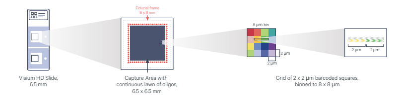
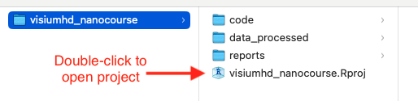
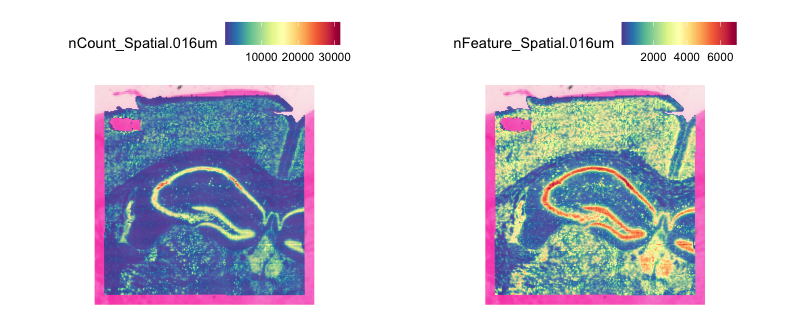
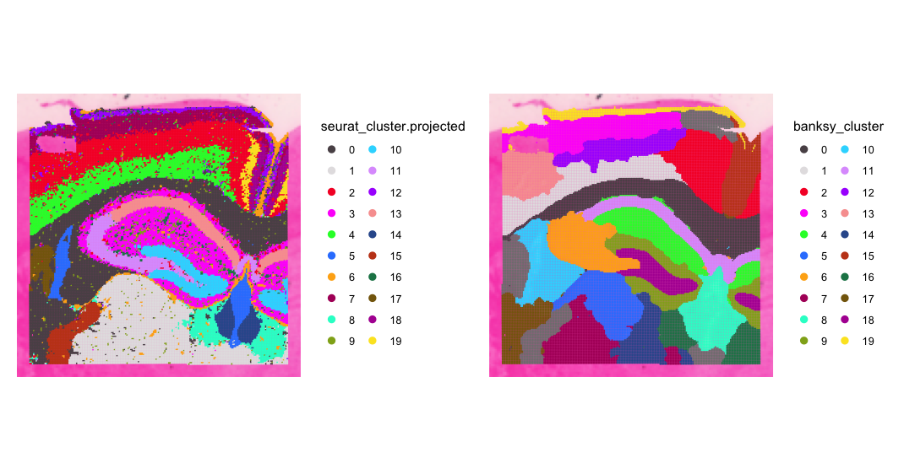

Contributors: Alex Bartlett, Meeta Mistry, and Will Gammerdinger

Approximate time: 2 hours 45 minutes

## Learning Objectives 

**Revisit these when the materials are more complete**

In this lesson, we will:
- Describe the elements of the Seurat object that are unique to spatial technologies (Learning Objective 1)
- Visually inspect and compare spatial scRNA-seq data before and after filtering (Learning Objective 2)
- Interact with the spatial seurat object to superimpose cluster onto the image (Learning Objective 3)

# NGS-based Spatial Transcriptomics Data Analysis

## Mouse Brain Visium HD 

The Visium HD platform is compatible with human and mouse fresh frozen, fixed frozen, and formalin-fixed parrafin-embedded (FFPE) tissue sections. For this lesson, we will be working with data from a fresh frozen coronal section of a mouse brain sample.

Each Visium HD slide has the same 6.5 x 6.5mm capture area as previous Visium products but is covered with about 11 million tiles. These 2 um x 2 um squares are arrayed in a continuous lawn across the entire capture area. The squares are each uniquely barcoded with an oligonucleotide and contain probes allowing for the detection of the full coding transcriptome. 




## Preprocessing Data with Spaceranger

Sequencing facilities often output scRNAseq data, including spatial scRNAseq data, in FASTQ format. Because this is VisiumHD data from 10X Genomics, we use their proprietary preprocessing software [Space Ranger](https://www.10xgenomics.com/support/software/space-ranger/latest) to process the FASTQ files into a count matrix and other images. Specifically, the ```spaceranger count``` command aligns the reads in the FASTQ files against a transcriptomic reference and provides their spatial location using the oligonucleotide barcode. 

**put this code in a dropdown** An example ```spaceranger count``` command is as follows:

```
 spaceranger count --id=hd_count \
   --transcriptome=/path/to/refdata-gex-GRCh38-2020-A \
   --fastqs=/path/to/fastq \
   --probe-set=/path/to/Visium_Human_Transcriptome_Probe_Set_v2.0_GRCh38-2020-A.csv \
   --slide=H1-YD7CDZK \
   --area=A1 \
   --cytaimage=/path/to/CAVG10539_2023-11-16_14-56-24_APPS115_H1-YD7CDZK_A1_S11088.tif \
   --image=/path/to/APPS115_11088_rescan_01.btf \
   --create-bam=false

```

Note that Space Ranger requires a Linux system with at least 32 cores, 64GB of RAM, and 1TB of disk space. 

When ```spaceranger count``` completes successfully, it will generate output similar to the following, which will enable the analyst to perform further analysis in R or Python or using the proprietary Loupe browser from 10X. 


In the Visium HD assay, in addition to providing data at the level of the 2 um squares, Space Ranger also bins the 2 um squares into 8 um x 8 um and 16 um x 16 um bins. Most of the above output is produced for each binning resolution. 

While the single-digit micron resolution is a big technological improvement over original Visium’s original ∼55 μm spots, the higher resolution also presents challenges. Having access to 2 μm bins along with matching morphology information provides great potential to reconstruct single cells from the data, which is undoubtedly very powerful. However, because the 2 um squares (and even the 8 um bins) are so small, there is a potential for very little biological signal to be captured per-bin. Additionally, the sheer number of bins at these higher resolutions can present challenges in terms of computational time and resources. **For the purposes of this lesson, we will use the 16µm binning.**

We can view and explore the web summary HTML of our data [here](../reports/web_summary.html)


## Analysis workflow

**Insert figure of workflow here** - can create this after the lesson is complete.

### Setting up 

* Here, we describe downloading and open the R project.
* Screenshot to show the directory structure (can create later)
* Open up a new R script and give it a header.

Some example text taken from scRNA-seq "Setup" is provided below:


For this module, we will be working within an RStudio project. In order to follow along you should have **downloaded the R project**.

> If you haven't done this already, the project can be accessed using [this link]().

Once downloaded, you should see a file called `visiumHD_nanocourse.zip` on your computer (likely, in your `Downloads` folder). 

1. Unzip this file. It will result in a folder of the same name. 
2. **Move the folder to the location on your computer where you would like to perform the analysis.**
3. Open up the folder. The contents will look like the screenshot below. 
4. **Locate the `.Rproj file` and double-click on it.** This will open up RStudio with the "visiumHD_nanocourse" project loaded. 

<p align="center">

</p>


Next, open a new Rscript file, and start with some comments to indicate what this file is going to contain:

```r
# February 18th, 2025
# Spatial transcriptomics nanocourse - or something else?
```

Save the Rscript as `visiumHD.R`. Your working directory should look something like this:

<p align="center">

</p>

## Loading Libraries

We load the libraries necessary...

```r
# Load libraries
library(tidyverse)
library(patchwork)
library(Seurat)
library(qs)
library(SeuratWrappers)
library(Banksy)
library(quadprog)
library(spacexr)

# do we need them to do this in class?
options(future.globals.maxSize= 2000000000)

```

## Creating the Seurat Object

The Seurat object is a custom list-like object that has well-defined spaces to store specific information/data for single cell experiments, including spatial experiments and Visium HD.

The Seurat package provides a function `Load10X_Spatial() to easily create a Seurat object from the output of Space Ranger. **We will not have you run this code**, as this can take some time and the spaceranger output files are quite large to share. Again, talk about inputs and outputs. 

**Put this code in a dropdown.** "Click here for R code used to create the Seurat object".

```r
# the dropdown will only contain code for one sample
localdir <- '../path_to/spaceranger/outs/'

# to load raw feature matrix
object <- Load10X_Spatial(data.dir = localdir,
                          filename = 'raw_feature_bc_matrix.h5',
                          bin.size = 16)


```

```
## Add this code as a script to the code folder. Add it as a part of a complete script that could reproduce the object we begin with

# cropped.coords <- Crop(object[["slice1.016um"]], x = c(500, 1200), y = c(800, 1600), coords = "plot")
# object[["zoom"]] <- cropped.coords
# 
# object_subset <- subset(object, cells = object@images$zoom$centroids@cells)
# object_subset[["zoom"]] <- NULL
# 
# SpatialDimPlot(object_subset)

```

**Add another script to `code` folder which deals with mutliple samples.**

```r
localdir <- '../spaceranger/outs/'

# list all samples with spaceranger output (may need to adjust string-parsing)
samples <- list.files(localdir)[grepl('LIB', list.files(localdir))]
names(samples) <- unlist(transpose(strsplit(samples, '_'))[3])

# one by one, load samples in to seurat objects
# not to run this you will need to have the hdf5r package installed
for (i in 1:length(samples)){
  object_sample <- Load10X_Spatial(data.dir = paste0(localdir, '/', samples[i], '/', 'spaceranger/outs/'),
                                   slice = names(samples)[i],
                                   filename = 'raw_feature_bc_matrix.h5',
                                   bin.size = 16)  # need to read in one bin at a time for multiple samples
  object_sample$orig.ident <- names(samples)[i]
  assign(paste0(samples[i], "_seurat"),
         object_sample) # stores Seurat object in variable of corresponding sample name
}
seurat_ID <- paste0(samples, "_seurat") # get names of all objects

###### for 2 samples #######

# merge 2 seurat objects into 1 seurat object
object <- merge(x = get(seurat_ID[1]),
                      y = get(seurat_ID[2]),
                      add.cell.ids = samples,
                      project = "mouse_brain_visiumhd")

###### for more than 2 samples #######

rest_of_samples <- get(seurat_ID[2])
for (i in 3:length(seurat_ID)) {
  rest_of_samples <- c(rest_of_samples, get(seurat_ID[i]))
} ## makes a list of all seurat objects

# merge more than 2 seurat objects into 1 seurat object
object <- merge(x = get(seurat_ID[1]),
                      y = rest_of_samples,
                      add.cell.ids = samples,
                      project = "mouse_brain_visiumhd")
```

### Explore the object

Let's read in the Seurat object and talk about some very basic slots that we will be accessing. 

**Why are we setting assay, when there is only one?** - Do we want to show them slots here? and then show that these change as we proceed through the workflow.

```
# Load in Seurat object
object <- qread( 'data_processed/MsBrain_FF-A1_subset.qs')

# Set assay
DefaultAssay(object) <- "Spatial.008um"
```

**Insert picture of Seurat object with spatial slots**

***

**Exercise**

This feels like a nice break for an exercise or even a question. I am not sure what yet because most of this feels like setting up the environment, but maybe have people explore the Seurat object a smidge? I know we are making an image for the scRNA-seq course on the Seurat object, maybe we could provide that and ask people what different slots look like in terms of data? This exercise should be reflective of Learning Objective 1, which might be like "Describe the elements of the Seurat object that are unique to spatial technologies"

***

## Quality Control

**ADD SOME MATERIAL FROM HBC WORKSHOPS**

The main objective of quality control is to filter the data so that we include only true cells that are of high quality. This makes it so that when we cluster our cells, it is easier to identify distinct cell type populations.

Challenges include:

- **Delineating cells that are poor quality from less complex cells** - Elaborate
- **Choosing appropriate thresholds for filtering, so as to keep high quality cells without removing biologically relevant cell types** - Elaborate

**Maybe insert an image or two for these challenges demonstrating the challenge if possible**

Various metrics can be used to filter low-quality cells from high-quality ones, including:

- **UMI counts per bin** - Elaborate
- **Genes detected per bin** - Elaborate
- **Complexity (novelty score)** - Elaborate
- **Mitochondrial counts ratio** - Elaborate

Let's take a quick look at the data and make a decision on whether we need to apply any filtering. We will examine the distributions of UMI counts per bin and genes detected per bin to determine reasonable thresholds for those metrics for QC filtering.

### Pre-filtering 
To create some plots first, we will need to create a metadata object using this command:

```r
object_meta <- object@meta.data
```

Nowe  can plot nUMI and nGnee side-by-side.
Add some text here - what do we see? What do we expect?

**include vertical threshold lines on the plot?**

```r

# Create a plot for nUMI
dist_counts_before <- object_meta %>%
  ggplot(aes(x=nCount_Spatial.016um)) +
  geom_density(alpha = 0.2) +
  scale_x_log10() +
  theme_classic() +
  ylab("Cell density") +
  xlab("Number of UMIs per bin") +
  ggtitle('Pre-QC Genes/Bin') 

# Create a plot for nGene
dist_features_before <- object_meta %>%
  ggplot(aes(x=nFeature_Spatial.016um)) +
  geom_density(alpha = 0.2) +
  scale_x_log10() +
  theme_classic() +
  ylab("Cell density") +
  xlab("Number of genes per bin") +
  ggtitle('Pre-QC UMIs/Bin') 

dists_before <- dist_counts_before | dist_features_before
dists_before
```

<p align="center">

</p>

### Post-Filtering

We will apply very minimal filtering here, with nUMI > 100 and nGene > 100. It has been shown that low expression can be biologically meaningful for spatial context so we won't be as stringent as we normally are with scRNA-seq.


```r
# Create a filtered object
object_filt <- subset(object, (nCount_Spatial.016um > 100) & 
                        (nFeature_Spatial.016um > 100))
```

Now we can create simialr plots with filtered data. **What do we see?** Comment here.

```r

# Create a new metadata data frame 
object_filt_meta <- object_filt@meta.data

# Plot nUMI
dist_counts_after <- object_filt_meta %>%
  ggplot(aes(x=nCount_Spatial.016um)) +
  geom_density(alpha = 0.2) +
  scale_x_log10() +
  theme_classic() +
  ylab("Cell density") +
  xlab("Number of UMIs per bin") +
  ggtitle('PostQC Genes/Bin')

# Plot nGene
dist_features_after <- object_filt_meta %>%
  ggplot(aes(x=nFeature_Spatial.016um)) +
  geom_density(alpha = 0.2) +
  scale_x_log10() +
  theme_classic() +
  ylab("Cell density") +
  xlab("Number of genes per bin") +
  ggtitle('PostQC UMIs/Bin')

# Combine plots side-by-side
dists_after <- dist_counts_after | dist_features_after
dists_after

```


<p align="center">

</p> 


### Visualizing Counts Data

We can visualize the number of counts per bin, both as a distribution and layered on top of the tissue image. Let's start with a violin plot to look at the distribution of UMI counts and gene counts. The input is our post-filtered dataset.

**What do we hope to see here?** What is good versus bad?

```r

# Violin plot of UMI counts
vln_counts_after <- VlnPlot(object_filt, 
                            features = "nCount_Spatial.016um", 
                            pt.size = 0, 
                            group.by = 'orig.ident') + 
  NoLegend() + scale_y_log10() + ggtitle('nUMI') + xlab('')

# Violin plot of gene counts
vln_features_after <- VlnPlot(object_filt, 
                            features = "nFeature_Spatial.016um", 
                            pt.size = 0, 
                            group.by = 'orig.ident') + 
  NoLegend() + scale_y_log10() + + ggtitle('nGene') +  xlab('')


# Plot both side by side
vln_counts_after | vln_features_after
```

<p align="center">

</p> 

Next, we can look at the same metrics and the distribution on the actual image itself. Note that many spots have very few counts, in part due to low cellular density or cell types with low complexity in certain tissue regions.

```r
# Visualizing UMI count across the image
image_counts <- SpatialFeaturePlot(object_filt, 
                                   feature = 'nCount_Spatial.016um', 
                                   pt.size.factor = 8)

# Visualizing gene count across the image
image_features <- SpatialFeaturePlot(object_filt, 
                                     features = "nFeature_Spatial.016um", 
                                     pt.size.factor = 8) 

# Plot the two side-by-side
image_counts | image_features

```

<p align="center">

</p> 


***

**Exercise**

**Not sure we need this** 

Perhaps have participants carry out the same QC plots for complexity and mitochondrial counts and get their impressions on the filtering. You may need to provide the code for creating these plots. This should be reflective of Learning Objective 2 and I am thinking it might be something like "Visually inspect and compare spatial scRNA-seq data before and after filtering"

***

## Normalize Data

Normalization is important in order to make expression counts comparable across genes and/or sample. Here we use a standard log-normalization for spatial data. We note that the best normalization methods for spatial data are still being developed and evaluated. 

```r
object_filt <- NormalizeData(object_filt, assay = 'Spatial.016um')
```

## Unsupervised Clustering

The authors of the Seurat package recommend the Seurat v5 sketch clustering workflow exhibits improved performance, especially for identifying rare and spatially restricted groups. Sketch-based analyses aim to ‘subsample’ large datasets in a way that preserves rare populations. 

**Is there a visualization for this workflow that we can include here?**

To help with performance in terms of both speed and quality of results, we will start with defining a set of highly variable genes. Once that is done, we will scale the data. _Note that this is being done on all cells in our object._

```r
object_filt <- FindVariableFeatures(object_filt)
object_filt <- ScaleData(object_filt)
```

Next, we select 10,000 cells and create a new sub-sampled 'sketch' assay using the `SketchData()` function. This data will get stored as a new assay in the object. **Talk about what this function does. What is the Leverage score? Break down each argument in the below command**. Why couldn't we run sketch without FindVariableFeatures / Scaling? It's unclear what impact this has on subsampling. More detail on sketch might resolve these questions.

```r
# we select 10,000 cells and create a new 'sketch' assay
object_filt <- SketchData(
  object = object_filt,
  assay = 'Spatial.016um',
  ncells = 10000,
  method = "LeverageScore",
  sketched.assay = "sketch"
)
```
Now that we have the sub-sampled data, we will switch to the "sketch" assay as our default. We will need to re-run some of the previous commands on this new sub-sampled assay. **Revisit `assays` and show how this has changed? We can also open the metadata to show that there is a column for leverage score**

```
# check metadata
object_filt@meta.data %>% View()

# check for new assays
object_filt@assays

# switch to analyzing the full dataset (on-disk)
DefaultAssay(object_filt) <- "Spatial.016um"

# switch to analyzing the sketched dataset (in-memory)
DefaultAssay(object_filt) <- "sketch"
```

Next, we will run previous commands **FindVariables an Scale**, this time on the sketch - for  a PCA, FindNeighbors, FindClusters **we have more detailed explanation for all of these in our scRNA-seq materials**, port some of that here.

```r
object_filt <- FindVariableFeatures(object_filt)
object_filt <- ScaleData(object_filt)
object_filt <- RunPCA(object_filt, assay = "sketch", reduction.name = "pca.sketch")
object_filt <- FindNeighbors(object_filt, assay = "sketch", reduction = "pca.sketch", dims = 1:50)
object_filt <- FindClusters(object_filt, cluster.name = "seurat_cluster.sketched", resolution = .65)
```

Finally, let's use UMAP using the principal components as input - **again UMAP explanation can be lifted from scRNA-seq**. Why do we get UMAP projects for the sub-sampled data and not the full dataset? 
**Can we plot the UMAP?**

```r
object_filt <- RunUMAP(object_filt, reduction = "pca.sketch", reduction.name = "umap.sketch", return.model = T, dims = 1:50)

# Plot UMAP
DimPlot(object_filt, reduction = "umap.sketch", label = T,  cols = 'polychrome') + 
  ggtitle("Sketched clustering") + 
  theme(legend.position = "none")
```

<p align="center">

</p> 


## Project cluster labels back to the full dataset

Now that we have our clusters from our subsampled dataset, we need to project these onto the full dataset. **How does this function work? Talk more about why?**  Note that the projected score for each spot will be saved as a column in the metadata. Actually opening up the metadata again gives the opportunity to look at the `seurat_cluster.sketched` column and see many NA values, because it is only on a subset of cells. The `seurat_cluster.projected` shows values for every spot/bin.

```

object_filt <- ProjectData(
  object = object_filt,
  assay = "Spatial.008um",
  full.reduction = "full.pca.sketch",
  sketched.assay = "sketch",
  sketched.reduction = "pca.sketch",
  umap.model = "umap.sketch",
  dims = 1:50,
  refdata = list(seurat_cluster.projected = "seurat_cluster.sketched")
)
```
**Break down each argument in the above command**

Let's save this object to file. **Now or later?**

```
qsave(object, '../data_processed/visiumhd_intestine_clustered.qs')
```

### Visualizing the projected clusters on UMAP

We can now visualize our clusters from the projected assignments.

```r
# switch to full dataset assay
DefaultAssay(object_filt) <- "Spatial.016um"

# Change the idents to the projected cluster assignments
Idents(object_filt) <- "seurat_cluster.projected"

# Plot the UMAP
DimPlot(object_filt, reduction = "full.umap.sketch", label = T, raster = F, 
              cols = 'polychrome') +
  ggtitle("Projected clustering") + 
  theme(legend.position = "none")

```


<p align="center">

</p>


### Visualizing projected clusters on the image

In order to see the clusters superimposed on our image we can use the `SpatialDimPlot()` function. We will also set the color palette and convert the cluster assignments to a factor so they are ordered numerically in the figure.

```r

# Arrange so clusters get listed in numerical order
object_filt$seurat_cluster.projected <- object_filt$seurat_cluster.projected %>% 
  as.numeric %>% as.factor()

# Set color palette
color_pal = Seurat::DiscretePalette(n = length(unique(object_filt$seurat_cluster.projected)),
                                    palette = "polychrome")
names(color_pal) <- sort(unique(object_filt$seurat_cluster.projected))
image_seurat_clusters <- SpatialDimPlot(object_filt, 
                                        group.by = 'seurat_cluster.projected', 
                                        pt.size.factor = 8, cols = color_pal) +
  guides(fill=guide_legend(ncol=2))


image_seurat_clusters
```

<p align="center">

</p>


## Spatially-informed Clustering

BANKSY is another method for performing clustering. Unlike Seurat, BANKSY takes into account not only an individual spot’s expression pattern but also the mean and the gradient of gene expression levels in a spot’s broader neighborhood. This makes it valuable for identifying and segmenting spatial tissue domains.


```r
# Run Banksy
object_filt <- RunBanksy(object_filt, lambda = 0.8, verbose = T,
                         assay = 'Spatial.016um', slot = 'data', k_geom = 50)

```

Show that we now have another assay? Uses only 4000 features?

```
$BANKSY
Assay data with 4000 features for 41818 cells
First 10 features:
 Ttr, Enpp2, Sst, Igf2, Ecrg4, Ptgds, Npy, Prlr, Clic6, Hbb-bs 

```

Now continue through previous steps - running on the BANKSY assay

```r
object_filt <- RunPCA(object_filt, assay = "BANKSY", 
                      reduction.name = "pca.banksy", 
                      features = rownames(object_filt), npcs = 30)
object_filt <- FindNeighbors(object_filt, reduction = "pca.banksy", 
                             dims = 1:30)
object_filt <- FindClusters(object_filt, cluster.name = "banksy_cluster",
                            resolution = 0.5)
```

Let's visualize the banksy clusters alongside the Seurat clusters for a side-by-side comparison:

```

color_pal = Seurat::DiscretePalette(n = length(unique(object_filt$banksy_cluster)),
                                    palette = "polychrome")
names(color_pal) <- sort(unique(object_filt$banksy_cluster))

image_banksy_clusters <- SpatialDimPlot(object_filt, group.by = "banksy_cluster", pt.size.factor = 7,
               cols = color_pal)

image_seurat_clusters | image_banksy_clusters

```

<p align="center">

</p>


**Add some comments here on a compare/contrast.**


## Celltype Annotation
Perhaps we are particularly interested in understanding the organization of cell types in the cortical region of the brain. We first subset our Seurat object to this region of interest. **Add some information here on wy you chose the clusters below to be defined as cortex?**

```{r}
cortex <- subset(object_filt, seurat_cluster.projected %in% c(18, 19, 7, 2, 4))

color_pal = Seurat::DiscretePalette(n = length(unique(object_filt$seurat_cluster.projected)),
                                    palette = "polychrome")
names(color_pal) <- sort(unique(object_filt$seurat_cluster.projected))
SpatialDimPlot(cortex, group.by = 'seurat_cluster.projected', 
               pt.size.factor = 8, cols = color_pal)
```

To perform accurate annotation of cell types, we must also take into consideration that our 16 um spots may contain one or more cells each. The method Robust Cell Type Deconvolution (RCTD) has been shown to accurately annotate spatial data from a variety of technologies while taking into consideration that a single spot may exhibit multiple cell type profiles.

RCTD takes an scRNA-seq dataset as a reference and a spatial dataset as a query. For a reference, we use a subsampled version of the mouse scRNA-seq dataset from the Allen Brain Atlas. We use our cortex Seurat object as the spatial query. For computational efficiency, we sketch the spatial query dataset, apply RCTD to deconvolute the ‘sketched’ cortical cells and annotate them, and then project these annotations to the full cortical dataset.


***

*These materials have been developed by members of the teaching team at the [Harvard Chan Bioinformatics Core (HBC)](http://bioinformatics.sph.harvard.edu/). These are open access materials distributed under the terms of the [Creative Commons Attribution license](https://creativecommons.org/licenses/by/4.0/) (CC BY 4.0), which permits unrestricted use, distribution, and reproduction in any medium, provided the original author and source are credited.*
